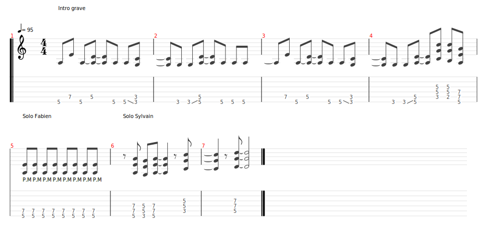

# Hells Bells

- Date de sortie 25 Juillet 1980
- [Video](https://youtu.be/etAIpkdhU9Q?si=saQ716uQ2GI3Qddh)
- [Wikiepdia](https://fr.wikipedia.org/wiki/Hells_Bells)

## Comment on la joue

| Partie      | Comment                                                                                                                                                                                                                                             | Mesures                                                        |
|-------------|-----------------------------------------------------------------------------------------------------------------------------------------------------------------------------------------------------------------------------------------------------|----------------------------------------------------------------|
| Intro       | - Sylvain   - Fabien   - Candice et Bertrand (version grave)                                                                                                                                                                              | 4 mesures   4 mesures    16 mesures                  |
| Pré-Couplet | - On calme le jeu                                                                                                                                                                                                                                   | 4 mesures                                                      |
| Couplet     |                                                                                                                                                                                                                                                     | 8 mesures + 8 mesures                                          |
| Refrain     |                                                                                                                                                                                                                                                     | 8 mesures                                                      |
| Pré-Couplet | - On calme le jeu                                                                                                                                                                                                                                   | 4 mesures                                                      |
| Couplet     |                                                                                                                                                                                                                                                     | 8 mesures + 8 mesures                                          |
| Refrain     |                                                                                                                                                                                                                                                     | 8 mesures                                                      |
| Pré-solos   | - On coupe tout, juste basse / batterie   - Entrée arpèges Sylvain   - Solo Fabien (Candice et Bertrand entrent en PM, on augmente l'intensité doucement)   - Solo Sylvain (Candice, Fabien et Bertrand power chords, on lache tout) | 4 mesures   2 mesures   16 mesures   16 mesures |
| Refrain     |                                                                                                                                                                                                                                                     | 16 mesures                                                     |

[TuxBoard](./Hells_bells.tg)