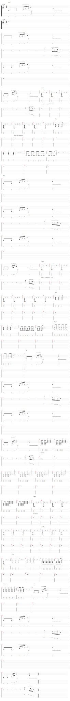

# Come together (reprise de The Beatles)

- Date de sortie 2017
- [Vidéo](https://youtu.be/r7imYeuAfkg?si=CvDGPd38j-KhibAQ)

## Technique
Je ne sais pas comment reproduire fidèlement sur tux guitar la version que l'on a faite.

- Pour le couplet, on fait un Palm Mute que l'on laisse résoner et que l'on stoppe sur le deuxième temps
- Pour les slides durant le solo de Mahé, la représentation sur la tablature n'est tout à fait exacte pas exacte :
  - On entame le slide après la troisième note, directement sans jouer les cordes avec le médiator
- On finit net sur la dernière note du riff

## Comment on la joue

- Riff
- Couplet
- Pont
- Riff
- Couplet
- Pont
- Refrain
- Riff
- Solos
- Couplet
- Pont
- Refrain
- Riff

[Partition](Come_together.tg)

