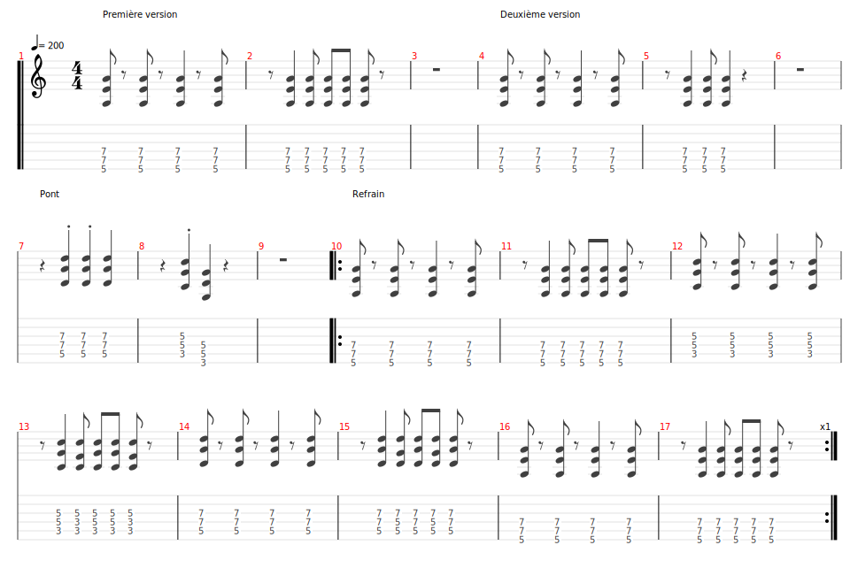

# Are you gonna be my girl

- Date de sortie 2003
- [Wikipedia](https://en.wikipedia.org/wiki/Are_You_Gonna_Be_My_Girl)
- [Vidéo](https://youtu.be/tuK6n2Lkza0?si=PESDylOFLI-NzCAh)

## Comment on la joue

La difficulté se trouve surtout dans le pont et la sortie du refrain où l'on commence sur le temps faible de la mesure (
soit le 2ème temps)

| Partie                     | Comment                                                                                                                                                                                  | Mesures                                                                            | 
|----------------------------|------------------------------------------------------------------------------------------------------------------------------------------------------------------------------------------|------------------------------------------------------------------------------------|
| Intro                      | - John et Eric   - Mathieu, Sylvain, Vincent Thème                                                                                                                                  | 8 mesures (1 tourne complète et non 2)   1 mesure (entrée sur la 8ème mesure) |
| Riff                       | - Mathieu, Sylvain, Vincent, Bertrand                                                                                                                                                    | 8 mesures (on baisse l'intensité)                                                  |
| Couplet                    | - Mathieu, Sylvain, Vincent, Bertrand                                                                                                                                                    | 18 mesures                                                                         |
| Pont                       | - Mathieu, Sylvain, Vincent, Bertrand                                                                                                                                                    | 8 mesures                                                                          |
| Refrain                    | - Mathieu, Sylvain, Vincent, Bertrand                                                                                                                                                    | 16 mesures                                                                         |
| Sortie refrain             | - Mathieu, Sylvain, Vincent, Bertrand                                                                                                                                                    | 8 mesures                                                                          |
| Couplet                    | - Mathieu, Sylvain, Vincent, Bertrand                                                                                                                                                    | 18 mesures                                                                         |
| Pont                       | - Mathieu, Sylvain, Vincent, Bertrand                                                                                                                                                    | 8 mesures                                                                          |
| Refrain                    | - Mathieu, Sylvain, Vincent, Bertrand                                                                                                                                                    | 16 mesures                                                                         |
| Sortie refrain             | - Mathieu, Sylvain, Vincent, Bertrand                                                                                                                                                    | 8 mesures                                                                          |
| Partie Groove (avec solos) | - Mathieu, accords ouverts La / Sol / Re / Fa   - Sylvain, triades Lam / Sol / Re / Fa   - Vincent, accords en intervalles La / Sol / Re / Fa   - Bertrand Solo           | 32 mesures                                                                         |                                                                         
| Partie Groove (avec solos) | - Mathieu, accords ouverts La / Sol / Re / Fa   - Sylvain, Solo   - Vincent, accords en intervalles La / Sol / Re / Fa   - Bertrand, power chord muté La / Sol / Fa# / Fa | 32 mesures                                                                         |                                                                         

### Rappels accords

[Accords](Are_you_gonna_be_my_girl.tg)

