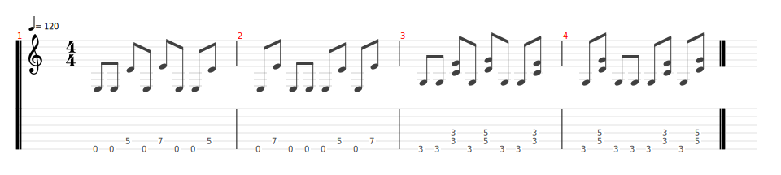

# Are you gonna go my way

- Date de sortie Février 1993
- [Vidéo](https://youtu.be/YlUKcNNmywk?si=eKkUV6ePxkRrET5r)
- [Wikipedia](https://fr.wikipedia.org/wiki/Are_You_Gonna_Go_My_Way_(chanson)
- Vidéos disponibles dans le groupe `Solidarité gratteux` datant du 19 Avril 2025

## Comment on la joue ?

### Pour le concert

**Répétition du 10/05/2025 :**

- Guitaristes :
    - Intro : Sylvain et Bertrand Thème grave
    - Thème : Candice et Lenny dans les aigus, Sylvain, Vincent et Bertrand dans les graves
    - Solo : Sylvain, Vincent, Lenny, Bertrand

| Partie   | Comment                                                                                                                                                               | Mesures                    | 
|----------|-----------------------------------------------------------------------------------------------------------------------------------------------------------------------|----------------------------|
| Intro    | - Sylvain et Bertrand, thème dans les graves   - Candice, Lenny et Vincent rejoignent après la 2ème tourne sur le thème aigu                                     | 2 tournes   2 tournes |
| Couplet  | - Candice, Lenny, Vincent et Sylvain accords   - Bertrand, accompagnement métal                                                                                  | 8 tournes                  |
| Refrain  | Tout le monde                                                                                                                                                         | 6 tournes                  |
| Pause    | Eric à la Batterie                                                                                                                                                    | 4 temps                    |
| Pont     | - On reprend comme l'intro :   - Sylvain et Bertrand, thème dans les graves   - Candice, Lenny et Vincent rejoignent après la 2ème tourne sur le thème aigu | 4 tournes                  |
| Couplet  | - Candice, Lenny, Vincent et Sylvain accords   - Bertrand, accompagnement métal                                                                                  | 8 tournes                  |
| Refrain  | Tout le monde                                                                                                                                                         | 6 tournes                  |
| Pause    | Eric à la Batterie                                                                                                                                                    | 4 temps                    |
| Pré-solo | - Sylvain, Candice et Bertrand thème pré-solo   - Vincent accords                                                                                                | 4 temps                    |
| Solos    | Pendant les solos, on reprend le thème pré-solo, doucement  - Lenny   - Bertrand   - Sylvain   - Vincent                                          |                            |
| Refrain  | On prend la 2ème partie du refrain (les slides)                                                                                                                       | 1 tourne                   |

### Accompagnement métal
[Partition](accompagnement_metal.tg)
