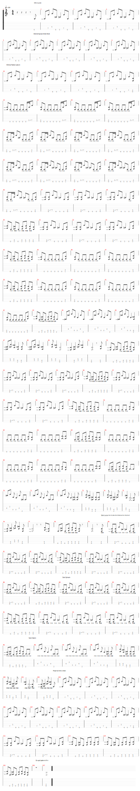

# Enter Sandman
- Date de sortie 1991
- [Vidéo](https://youtu.be/CD-E-LDc384?si=MopIs0LZqFXMOBeJ)
- [Wikipedia](https://fr.wikipedia.org/wiki/Enter_Sandman)

## Comment on la joue
- Intro clean - 4 mesures
- Intro clean + WahWah - 4 mesures
- Intro clean + Intro saturée - 4 mesures
- Riff Intro 3 x 4 mesures
- Riff principal x 2
- Couplet + Pont (volume baissé)
- Refrain (volume baissé)
- Riff principal x 1 (on envoie)
- Couplet + Pont (volume baissé)
- Refrain (volume baissé)
- Break
- Solo 1 :
  - Lucas en MI
  - Riff principal mute (volume baissé)
- Solo 2 :
  - Fabien en MI
  - Riff principal mute (volume baissé)
- Solo 3 :
  - Sylvain en FA#
  - Pont mute (volume baissé)
- Break Fabien
- Intro clean - 8 mesures
- Riff principal x 2
  - Sur la dernière mesure du second riff, on joue la variante avec arrêt net
- Break Eric
- Gros accord final

[Partition](Enter_Sandman.tg)

