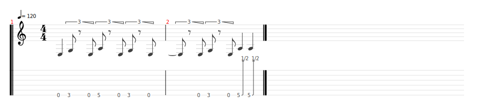
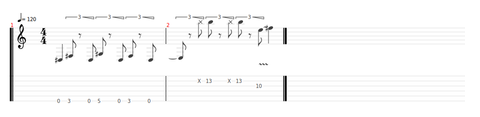
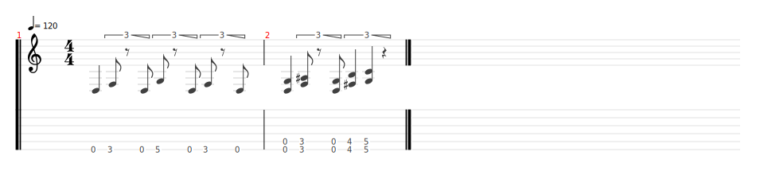
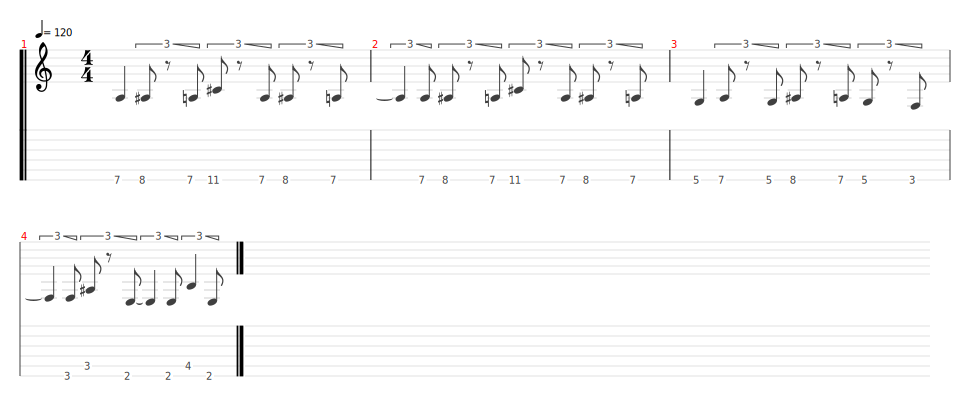
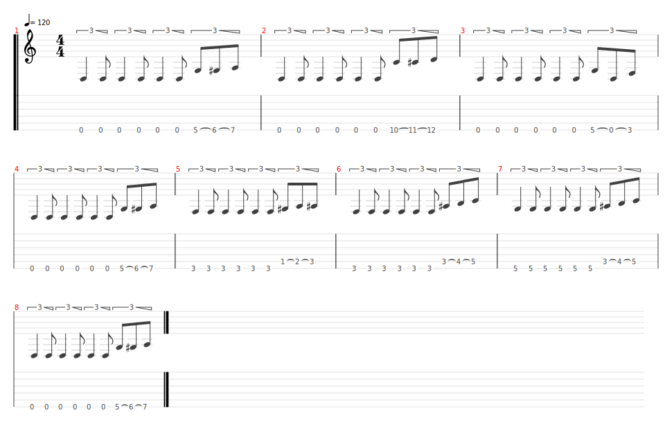
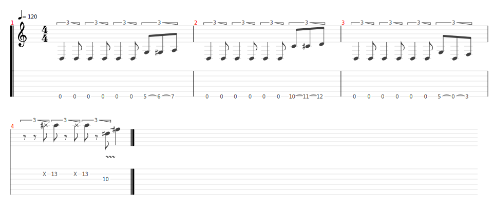
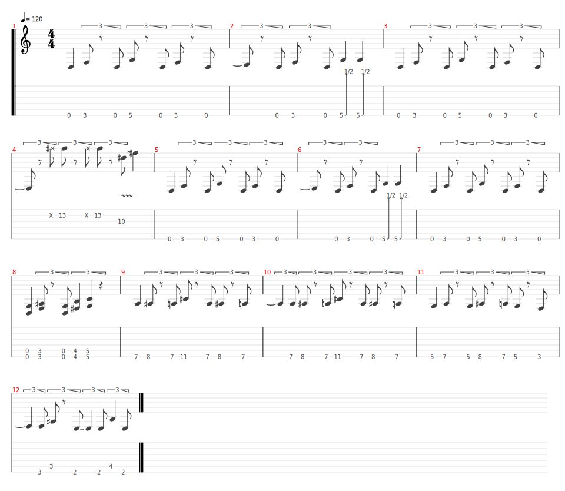

# Psycho

- Date de sortie 12 Mars 2015
- [Video](https://youtu.be/UqLRqzTp6Rk?si=ukXi9Q6IvwmQYmm-)
- [Wikiepdia](https://fr.wikipedia.org/wiki/Psycho_(chanson_de_Muse))

## Comment on la joue

### Version du 29/03/2025

| Partie  | Comment                                                                                                                                                                                                                                                                     | Mesures                                                                       |
|---------|-----------------------------------------------------------------------------------------------------------------------------------------------------------------------------------------------------------------------------------------------------------------------------|-------------------------------------------------------------------------------|
| Intro   | Riff principal (4 x 2 mesures) 1 seule guitare  Riff principal 2 (2 mesures) tous ensemble (Sylvain dans les aigus)  Riff principal (2 mesures)   Riff principal 3 (2 mesures)   Riff 2 (4 mesures)   Partie Jazz 4 mesures (Intervention Sylvain) | 10 mesures + 2 mesures + 2 mesures + 2 mesures + 4 mesures + 4 mesures (solo) |
| Couplet | Couplet (2 x 8 mesures)   Couplet fin (3 mesures + 1 mesure)                                                                                                                                                                                                           | 8 mesures + 8 mesures + 3 mesures + 1 mesure                                  |
| Refrain | Refrain + Partie Jazz 4 mesures                                                                                                                                                                                                                                             | 4 mesures + 4 mesures + 4 mesures + 4 mesures silence                         |
| Couplet | Couplet (2 x 8 mesures)   Couplet fin (3 mesures + 1 mesure)                                                                                                                                                                                                           | 8 mesures + 8 mesures + 3 mesures + 1 mesure                                  |
| Refrain | Refrain + Partie Jazz 4 mesures                                                                                                                                                                                                                                             | 4 mesures + 4 mesures + 4 mesures + 1 mesure silence + 3 mesures tremolo      |
| Couplet | Couplet (2 x 8 mesures) en palm mute avec octaves Sylvain   Couplet (2 x 8 mesures) sans palm mute en montant en intensité avec octaves Sylvain                                                                                                                        | 8 mesures                                                                     |
| Break   | 1 mesure, on arrête net                                                                                                                                                                                                                                                     | 4 mesures + 4 mesures + 4 mesures + 1 mesure silence + 3 mesures tremolo      |
| Solo    | 8 x 2 mesures (Octaves + power chords)   8 x 2 mesures (Octaves + power chords en montant en intensité)                                                                                                                                                                | 8 mesures                                                                     |

### Version studio

| Partie    | Comment                                                                                                                                                                                                                           | Mesures                                                                       |
|-----------|-----------------------------------------------------------------------------------------------------------------------------------------------------------------------------------------------------------------------------------|-------------------------------------------------------------------------------|
| Intro     | Riff principal (5 x 2 mesures)   Riff principal 2 (2 mesures)   Riff principal (2 mesures)   Riff principal 3 (2 mesures)   Riff 2 (4 mesures)   Solo 4 mesures                                          | 10 mesures + 2 mesures + 2 mesures + 2 mesures + 4 mesures + 4 mesures (solo) |
| Couplet   | Couplet (2 x 8 mesures)   Couplet fin (3 mesures + 1 mesure)                                                                                                                                                                 | 8 mesures + 8 mesures + 3 mesures + 1 mesure                                  |
| Refrain   |                                                                                                                                                                                                                                   | 4 mesures + 4 mesures + 4 mesures + 4 mesures silence                         |
| Couplet   |                                                                                                                                                                                                                                   | 8 mesures + 8 mesures + 3 mesures + 1 mesure                                  |
| Refrain   |                                                                                                                                                                                                                                   | 4 mesures + 4 mesures + 4 mesures + 1 mesure silence + 3 mesures tremolo      |
| Interlude |                                                                                                                                                                                                                                   | 8 mesures                                                                     |
| Refrain   |                                                                                                                                                                                                                                   | 4 mesures + 4 mesures + 4 mesures + 1 mesure silence + 3 mesures tremolo      |
| Interlude | Peut se jouer de 2 manières différentes   - Soit on reprend le riff principal   - Soit on joue les 2 dernières notes des mesures 3 et 4 (4 mesures) du riff et on enchaine de nouveau sur le riff principal (4 mesures) | 8 mesures                                                                     |
| Pont      |                                                                                                                                                                                                                                   | 16 mesures                                                                    |
| Refrain   |                                                                                                                                                                                                                                   | 4 mesures                                                                     |

### Riff Principal

### Riff Principal 2

### Riff principal 3

### Riff 2

### Couplet

### Couplet fin

### Refrain

