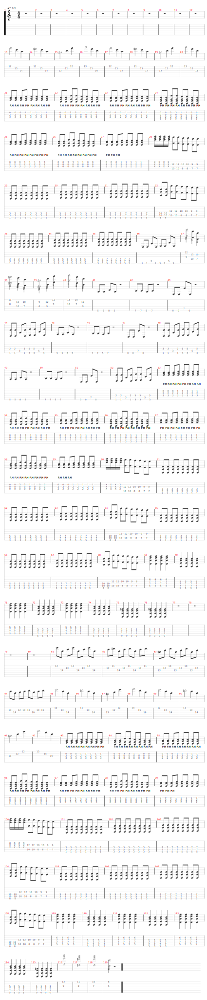

# Time is running out

- Date de sortie 8 septembre 2003
- [Vidéo](https://youtu.be/O2IuJPh6h_A?si=DhmfB_0qmz2JVLee)
- [Wikipedia](https://en.wikipedia.org/wiki/Time_Is_Running_Out_(Muse_song))

## Comment on la joue

### Structure

|                    |                                                                                                                                                             |                           |
|--------------------|-------------------------------------------------------------------------------------------------------------------------------------------------------------|---------------------------|
| **Intro**          | - Accords Arpèges (Mathieu + Vincent)   - Arpèges (Sylvain + Bertrand) + Chant (Entrèe sur la 2ème tourne)                                              | 1 tourne   4 tournes |
| **Montée (Toms)**  | - Son clair (Mathieu, Vincent et Bertrand)   - Thème chant (Sylvain)                                                                                   | 2 tournes                 |
| **Refrain**        | - Son saturé   - ⚠️ Riff sortie                                                                                                                   | 2 tournes                 |
| **Couplet**        | - Riff muté (Mathieu + Vincent) + Octaves (Sylvain + Bertrand)   - Riff muté (tout le monde)                                                           | 1 tourne   3 tournes |
| **Montée (Samba)** | - Son clair    (Mathieu, Vincent et Bertrand)   - Thème chant (Sylvain)                                                                                | 2 tournes                 |
| **Refrain**        | - Son saturé   - ⚠️Pas d'octave sur la fin du 2ème tour   - Accords punk (Mathieu + Vincent + Bertrand, sec sur le temps) + Thème chant (Sylvain) | 2 tournes                 |
| **Couplet**        | - Thème piano (Sylvain + Bertrand) + Accords Arpèges (Mathieu + Vincent)                                                                                    | 3 tournes                 |
| **Montée (Samba)** | - Son clair    (Mathieu, Vincent et Bertrand)   - Thème chant (Sylvain)                                                                                | 2 tournes                 |
| **Refrain**        | - Son saturé   - ⚠️Pas d'octave sur la fin du 2ème tour   - Accords punk (Mathieu + Vincent + Bertrand, sec sur le temps) + Thème chant (Sylvain) | 2 tournes                 |

### Structure Originale

- Intro bass
- Couplet chant avec basse + batterie
- 2 tours
- 3ème tour
    - Thème aigu guitare × 2
    - Montée palm mute F G Am Em x2
- Refrain
    - Power chord F G Am C x2
- Tremolo rapide x1
- Riff 2ème couplet x 2 (thème sur 2ème tour)
- Montée palm mute F G Am C x2
- Refrain Power chord F G Am C x 2
- Pont Dm Am x 2
- 3 eme tour Dm Am E
- Tremolo rapide x 2
- Montée palm mute F G Am Em x2

[Partition](./Time_is_running_out.tg)

