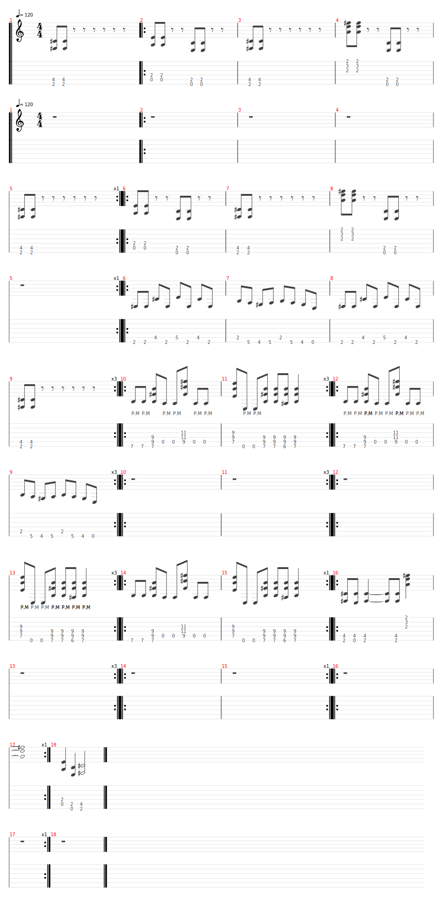

# Ozzy Osbourne Crazy train

- Date de sortie 1980
- [Vidéo](https://youtu.be/F0qcJrdWQT4?si=HnZaHK5oCZKsPgH8)
- 3 vidéos disponibles dans le groupe `Les énervés` datant du 3 Juin 2024

## Technique
**Riff crazy train**
- Index replié = force, donc à déplier pour la rythmique
  
  
- Main droite collée, c'est le poignet qui joue, pas le bras

## Comment on la joue
- 2 tournes riff intro
- 4 tournes riff principal
- Couplet
- Couplet mute
- Couplet on s'énerve
- Pont
- Refrain
- 1er solo
- Couplet
- Couplet mute
- Couplet on s'énerve
- Pont
- Refrain
- 2ème Solo
- 1 tourne riff intro normal
- 2 tournes riff intro avec un seul coup, dernier accord sec

[Partition](Crazy_Train.tg)

