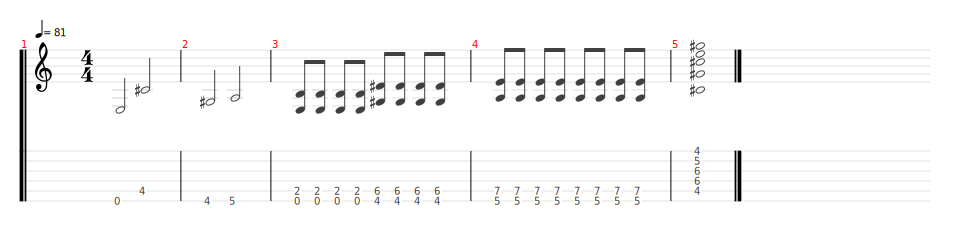
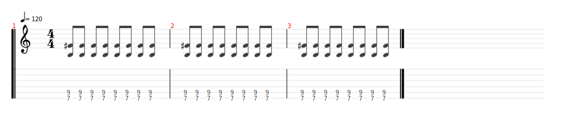

# Where is my mind

- Date de sortie 21 Mars 1988 ([Wikipedia](https://en.wikipedia.org/wiki/Where_Is_My_Mind%3F))
- [Video](https://youtu.be/OJ62RzJkYUo?si=hgZUSBQpyVNEuism)
- Vidéos disponibles :
    - Sur la chaine youtube dans `Ateliers de John`
    - Sur le groupe en date du 08/02/2025

## Comment on la joue ?

### Pour le concert

**Répétition du 10/05/2025  :**

- Ne pas s'appuyer intégralement sur les vidéos mentionnées ci-dessus
- Guitaristes : 
  - Thème : Candice, Lenny, Bertrand
  - Intro + accords rythmique : Sylvain
  - Accords rythmiques : Vincent
  - Solo : Lenny

| Partie  | Comment                                                                                                                                                  | Tourne                                      |
|---------|----------------------------------------------------------------------------------------------------------------------------------------------------------|---------------------------------------------|
| Intro   | - Sylvain lance l'intro   - Candice, Lenny et Bertrand lancent le thème après la 2ème tourne de Sylvain   - Vincent sur les accords rythmiques | 2 tournes   5 tournes   5 tournes |
| Pont    | Doucement                                                                                                                           | 2 tournes                                   |
| Couplet | Thème                                                                                                                                                    | 3 tournes                                   |
| Pont    | Doucement                                                                                                                           | 2 tournes                                   |
| Solo    | Lenny   Accompagnement solo                                                                      | 3 mesures                                   |
| Fin     | Thème en boucle                                                                                                                                          |                                             |

### Pont

[Partition pont](pont.tg)

### Accompagnement solo

[Partition accompagnement solo](accompagnement_solo.tg)