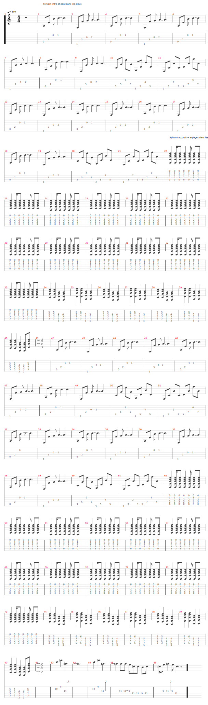
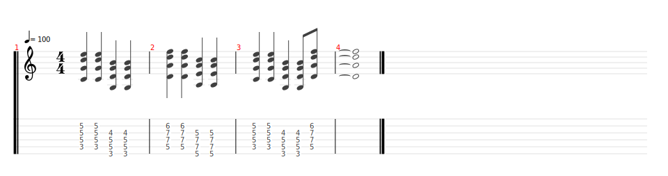
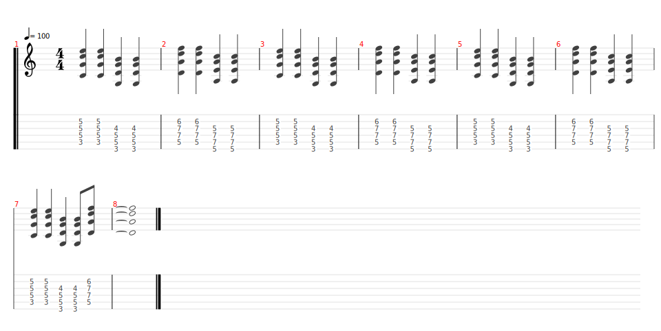
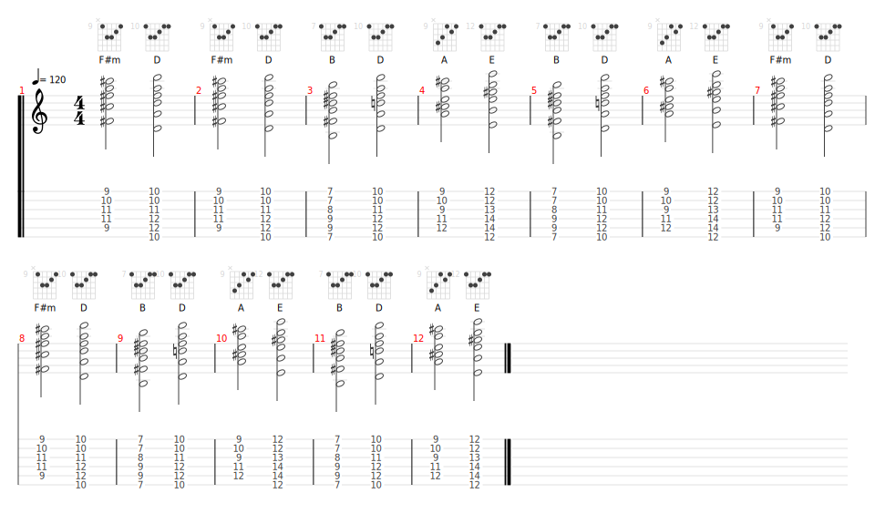

# Californication

- Date de sortie 8 Juin 1999
- [Vidéo](https://youtu.be/YlUKcNNmywk?si=eKkUV6ePxkRrET5r)
- Vidéos disponibles dans le groupe `Solidarité gratteux` datant du 14 Septembre 2024

## Technique

- Accords, en allers-retours sans stopper le balancier

## Comment on la joue ?

[Partition](Californication.tg)

### Pour le concert

**Répétition du 10/05/2025 :**

- Guitaristes :
    - Intro : Sylvain
    - Solo : Candice puis Sylvain
    - Lenny, Vincent, Bertrand

| Partie    | Comment                                                                                     | Tourne                   |
|-----------|---------------------------------------------------------------------------------------------|--------------------------|
| Intro     | Sylvain                                                                                     | 4 mesures                |
| Couplet 1 | Candice, Lenny, Vincent et Bertrand (après la 2ème tourne d'intro de Sylvain)               | 16 mesures               |
| Couplet 2 | Tout le monde                                                                               | 12 mesures               |
| Refrain 1 | **Attention, cette fois ci, on l'a joué comme l'originale**  | 4 mesures                |
| Couplet 1 | Tout le monde                                                                               | 16 mesures               |
| Couplet 2 | Tout le monde                                                                               | 12 mesures               |
| Refrain 2 |                                                              | 8 mesures                |
| Solo      | Candice (original)   Sylvain   Accords solo  | 16 + x (Sylvain) mesures |
| Couplet 1 | Tout le monde                                                                               | 10 mesures               |
| Couplet 2 | Tout le monde                                                                               | 12 mesures               |
| Refrain 2 |                                                              | 8 mesures                |

### Les accords durant le solo

[Partition](accords_solo.tg)

