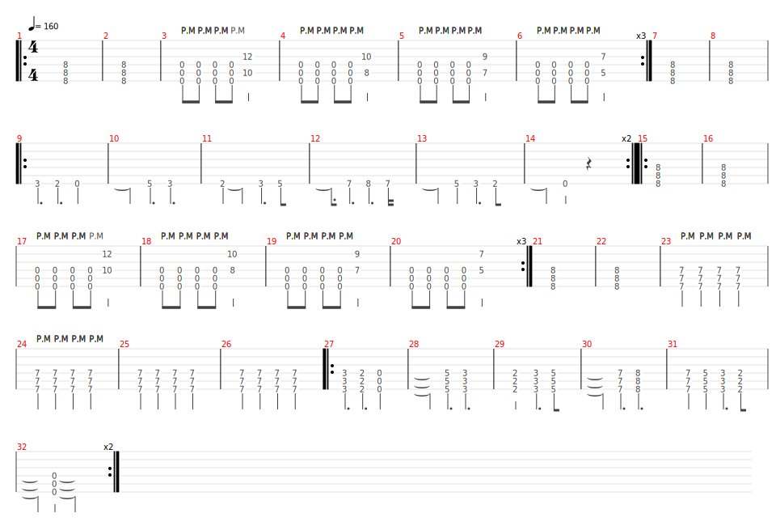

# System Of A Down
- Date de sortie 2002
- [Vidéo](https://youtu.be/rjfr9wNO8Tk?si=dVFSybzLTsyLHgrs)
- 1 vidéo disponible dans le groupe `Les énervés` datant du 10 juin 2024

## Technique
**Intro**
- L'articulation des doigts doit être la plus souple possible avec peu d'amplitude

## Comment on la joue
- Intro complète arpèges avec interventions tour à tour
- Refrain
- Couplet + solos
- Refrain
- Pont
- Riff

Ci-dessous la "partition" sans les arpèges d'intro, il ne faut pas trop regarder le tempo, ce sont les accords qui comptent

[Partition](Aerials.tg)
