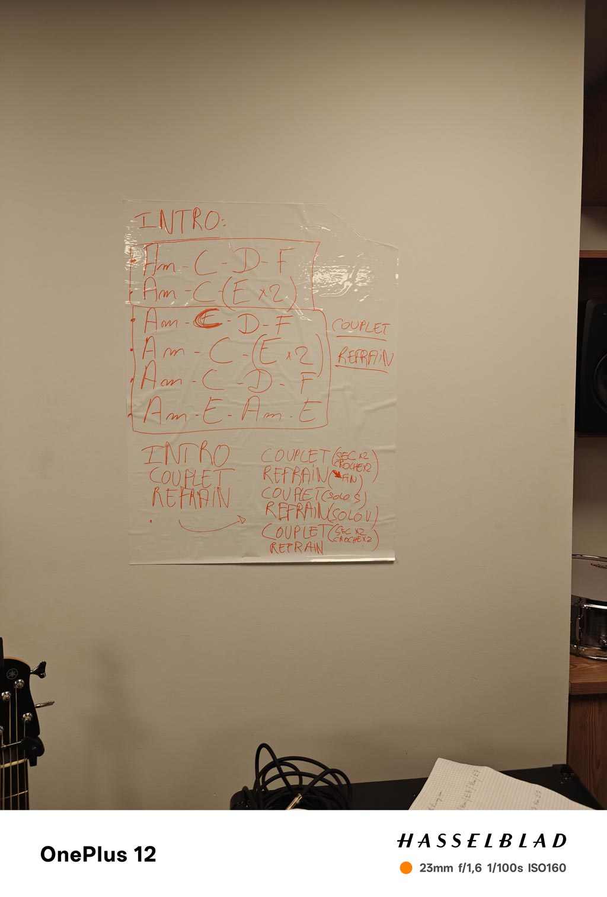
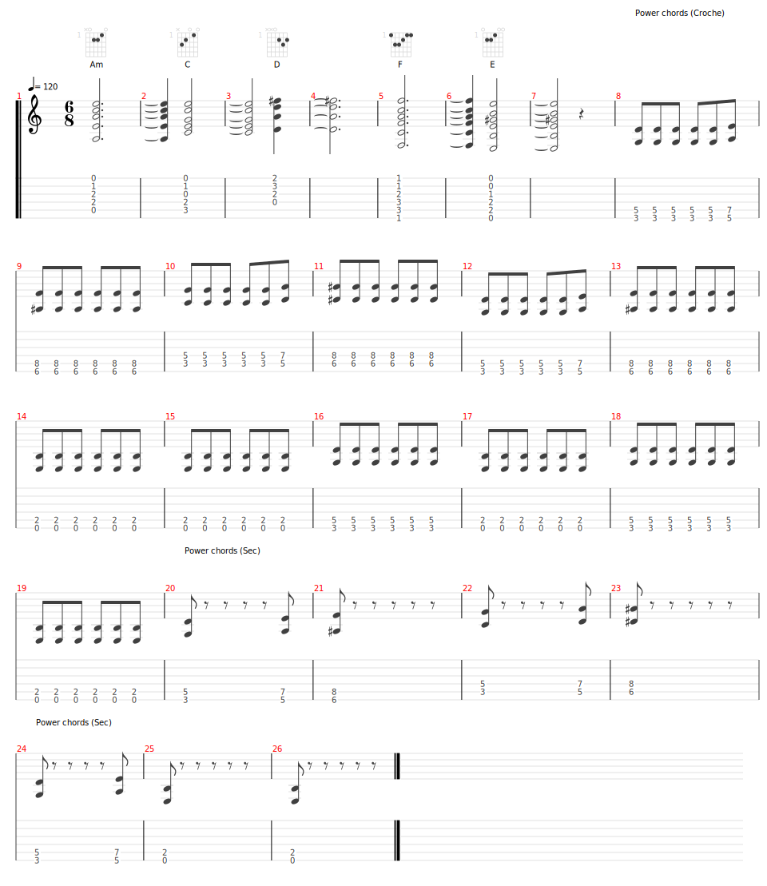

# House of the Rising Sun (version Shaka Ponk)
- Date de sortie 1964
- [Vidéo (originale)](https://youtu.be/N4bFqW_eu2I?si=_-3abDJXUsNYAATQ)
- [Vidéo (version Shaka Ponk)](https://youtu.be/sNLsy_XYpBM?si=mkjoghn9Rs6Apv07)
- [Wikipedia](https://fr.wikipedia.org/wiki/The_House_of_the_Rising_Sun)

## Comment on la joue

- Intro : 
  - Sylvain effet orgue (8 mesures)
- Couplet
  - Vincent accords (8 mesures) + John chant
  - Bertrand power chords (8 mesures)
- Refrain
- Couplet
  - Sec * 2
  - Croche * 2
- Refrain 
  - On baisse l'intensité à la fin
- Couplet
  - Solo Sylvain
- Refrain
  - Solo Vincent
- Couplet
    - Sec * 2
    - Croche * 2
- Refrain

[Accords](./structure.tg)

