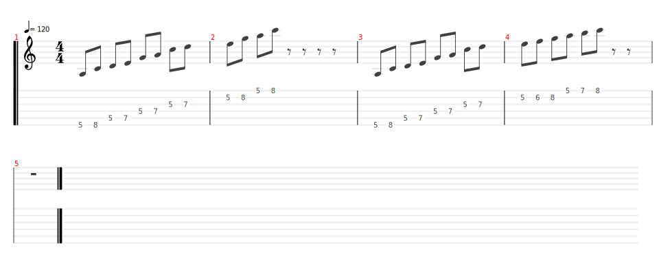

# House of the Rising Sun (version Shaka Ponk)

- Date de sortie 1964
- [Vidéo (originale)](https://youtu.be/N4bFqW_eu2I?si=_-3abDJXUsNYAATQ)
- [Vidéo (version Shaka Ponk)](https://youtu.be/sNLsy_XYpBM?si=mkjoghn9Rs6Apv07)
- [Wikipedia](https://fr.wikipedia.org/wiki/The_House_of_the_Rising_Sun)
- Vidéos disponibles sur le groupe en date du 16/11/2024

## Comment on la joue

### Version de Novembre 2024

- Intro :
    - Sylvain effet orgue (8 mesures)
- Couplet
    - Vincent accords (8 mesures) + John chant
    - Bertrand power chords (8 mesures)
- Refrain
- Couplet
    - Sec * 2
    - Croche * 2
- Refrain
    - On baisse l'intensité à la fin
- Couplet
    - Solo Sylvain
- Refrain
    - Solo Vincent
- Couplet
    - Sec * 2
    - Croche * 2
- Refrain

### Version de Février 2025

- Intro :
    - Sylvain, arpèges + Vincent, interventions solo 16 mesures
- Couplet :
    - Eric, accords ouverts + Vincent accords pal mute à la croche 8 mesures
    - Bertrand : power chords palm mute 4 mesures
- Montée :
    - Accords + Power chords, on monte en intensité
    - 2 mesures en palm mute en partant très doucement
    - 1 mesure où on lâche le de palm mute progressivement et en lachant les coups sur la fin
    - 1 mesure à balle
- Refrain :
    - à balle
    - On baisse d'intensité sur la fin
- Couplet (avec la réverb) :
    - Sec
    - 4 dernières messures à la croche en montant l'intensité
- Refrain :
    - à balle
    - On baisse d'intensité sur la fin
- Solos :
    - Pendant les solos, on reprend comme le couplet, sec en plam mute
    - Eric - Bertrand : questions réponses, 2 échanges chacun
    - Vincent - Sylvain : gros solos
    - Sur la fin du solo de Sylvain, on fait monter doucement l'intensité
- Refrain
- à balle

| Partie  | Comment                                                                                                                                         | Mesures                                   | 
|---------|-------------------------------------------------------------------------------------------------------------------------------------------------|-------------------------------------------|
| Intro   | Sylvain (arpèges) + Vincent (solos)                                                                                                             | 16 mesures                                |
| Couplet | - Eric (accords ouverts) + Vincent (PM)   - Bertrand                                                                                       | 16 mesures   8 mesures               |
| Montée  | - Palm mute doux   - Palm mute + montée en intensité   - Montée en intensité                                                          | 2 mesures   1 mesure   1 mesure |
| Refrain | - A balle   - Baisse d'intensité                                                                                                           | 14 mesures   2 mesures               |
| Couplet | - Sec avec la réverb   - On retire la reverb, on monte en intensité à la croche                                                            | 12 mesures   2 mesures               |
| Refrain | - A balle   - Baisse d'intensité                                                                                                           | 14 mesures   2 mesures               |
| Solos   | - Pendant les solos, on reprend comme le couplet, sec en plam mute   - Sur la fin du solo de Sylvain, on fait monter doucement l'intensité |                                           |
| Refrain | - A balle                                                                                                                                       | 16 mesures                                |

[Accords](./structure.tg)

### Pour le concert
**Répétition du du 10/05/2025**

- Guitaristes :
  - Intro : Sylvain
  - Accords : Vincent et Sylvain
  - Interventions : Candice et Lenny
  - Solos : Sylvain et Vincent
  - Thème : Bertrand

| Partie  | Comment                                                                                                                                         | Mesures                                  | 
|---------|-------------------------------------------------------------------------------------------------------------------------------------------------|------------------------------------------|
| Intro   | - Sylvain (arpèges)   - Candice et Lenny (interventions)                                                                                   | 16 mesures                               |
| Couplet | - Vincent (accords)   - Bertrand (son clair, PM)   - Candice et Lenny (interventions)                                                 | 16 mesures               |
| Montée  | - Distorsion   - Palm mute doux   - Palm mute + montée en intensité   - Montée en intensité                                      | 2 mesures   1 mesure   1 mesure |
| Refrain | - A balle   - Baisse d'intensité   - Candice et Lenny (interventions)                                                                                                          | 14 mesures   2 mesures              |
| Couplet | - Sec avec la réverb   - On retire la reverb, on monte en intensité à la croche                                                            | 12 mesures   2 mesures              |
| Refrain | - A balle   - Baisse d'intensité   - Candice et Lenny (interventions)                                                                                                          | 14 mesures   2 mesures              |
| Solos   | - Pendant les solos, on reprend comme le couplet, sec en plam mute   - Sur la fin du solo de Sylvain, on fait monter doucement l'intensité |                                          |
| Refrain | - A balle                                                                                                                                       | 16 mesures                               |

#### Interventions
En pentatonique de La, 2ème point soit :

[Partition](pentatonique_la.tg) (avec les notes sensibles en cordes de Si et Mi)
