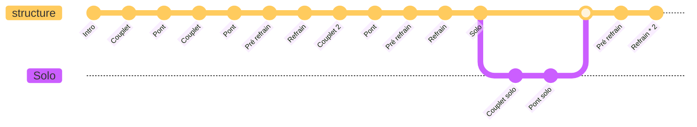
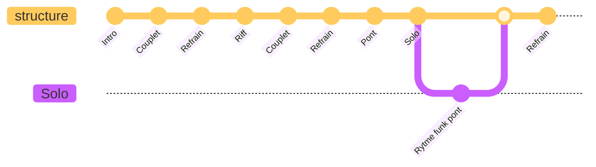

# Stage Rockstar Vincent / Bertrand

**Date :** À définir, 4 ou 13 Juin

| Date  | Horaire | Lieu    | Commentaires       |
|-------|---------|---------|--------------------|
| 29/04 | 18H00   | Cultura |                    |
| 06/05 | 18H00   | Cultura |                    |
| 16/05 | 11H00   | Cultura |                    |
| 30/05 | 11H00   | Cultura |                    |
| 03/06 | 18H00   | Cultura | Si concert 4 Juin  |
| 06/06 | 11H00   | Cultura | Si concert 13 Juin |

## Setlist

| Morceau                  | Artiste           | Liens                                                                                                                                  |
|--------------------------|-------------------|----------------------------------------------------------------------------------------------------------------------------------------|
| Born to be wild          | Steppenwolf       | - [Video](https://youtu.be/93fAJe8WVjA?si=D-gslDPFS0TnfiYB)   - [Backing track](https://youtu.be/_ahFAlcvf-Y?si=G2QzDJNH3KXIqM_z) |
| Everlong                 | Foo Fighters      | - [Video](https://youtu.be/eBG7P-K-r1Y?si=AdWE4GRojho5YT0d)   - [Backing track](https://youtu.be/ekMNpt50yUE?si=BLN4U9WHLxss_Ind) |
| Are you gonna be my girl | The Jet           | - [Video](https://youtu.be/tuK6n2Lkza0?si=mGptMqvmDcxYlYTt)   - [Backing track](https://youtu.be/H5XzV0d_4qg?si=IEG_AILXu5vSxUKc) |
| Psycho                   | Muse              | - [Video](https://youtu.be/UqLRqzTp6Rk?si=VpQ4SpVpYm_wwR1L)   - [Backing track](https://youtu.be/G7Fjt8Of4iY?si=a5utdPSLWleUvfSn) |
| Seven nation army        | The White Stripes | - [Video](https://youtu.be/0J2QdDbelmY?si=LIr5jHs4JFsUtyDL)   - [Backing track](https://youtu.be/mp1t2JmRhK8?si=kNG5XR3P-jzbflhh) |
| Are you gonna go my way  | Lenny Kravitz     | - [Video](https://youtu.be/8LhCd1W2V0Q?si=kwypzBAlmeUmDYg7)   - [Backing track](https://youtu.be/YoYAzY3ozoc?si=4j0sxVEtb2QPIhJh) |
| I'm Picky                | Shaka Ponk        | - [Video](https://youtu.be/-LVWXQ2F3KI?si=D0P6LezsExnW28hx)   - [Backing track](https://youtu.be/cLj6gXxWR18?si=hcPlTakLlnd_84Av) |

## Structures

### Born to be wild

### Are you gonna go my way 

## Proposition de travail

### 🎸 RÈGLE QUOTIDIENNE (base)

Chaque séance ≈1h :

- 10 min : échauffement
- 20 min : morceau difficile
- 20 min : morceau intermédiaire
- 10 min : morceau facile / révision / transitions

### 📆 PHASE 1 — Mise en place (26/04 → 29/04)

#### 📅 26/04

- Everlong (Foo Fighters) : intro + couplet
- Seven Nation Army (The White Stripes) : riff + structure
- Identifier les parties de 3 morceaux

#### 📅 27/04

- Are You Gonna Go My Way (Lenny Kravitz) : riff principal
- Psycho (Muse) : intro + couplet
- Born to Be Wild (Steppenwolf) : structure

#### 📅 28/04

- I'm Picky (Shaka Ponk) : intro + couplet
- Are You Gonna Be My Girl (Jet) : rythme
- Revoir transitions simples

### 🎤 29/04 — Répétition 1

👉 Tester structures simplifiées + repérer difficultés

### 📆 PHASE 2 — Consolidation (30/04 → 06/05)

#### 📅 30/04

- Everlong : couplet → refrain
- Jet : couplet + refrain
- Transitions

#### 📅 01/05

- Kravitz : riff + pré-refrain
- Muse : mise en place rythmique
- Seven Nation Army : propreté

#### 📅 02/05

- I'm Picky : couplet + refrain
- Born to Be Wild : enchaînement complet
- Transitions

#### 📅 03/05

- Everlong : enchaînement partiel
- Jet : tempo au métronome
- Révision globale

#### 📅 04/05

- Kravitz : solo (lentement)
- Muse : riff principal
- Travail transitions

#### 📅 05/05

- Run partiel (3 morceaux)
- Corriger erreurs

### 🎤 06/05 — Répétition 2

👉 Jouer les morceaux entiers (même imparfaits)

### 📆 PHASE 3 — Fluidité (07/05 → 16/05)

#### 📅 07/05

- Everlong : complet lent
- Seven Nation Army : groove
- Transitions

#### 📅 08/05

- Kravitz : solo + enchaînement
- Jet : énergie constante
- Révision

#### 📅 09/05

- I'm Picky : mise en place
- Muse : enchaînement
- Transitions

#### 📅 10/05

- Run complet (lent)
- Identifier points faibles

#### 📅 11/05

- Travail ciblé erreurs
- Everlong (focus transitions)

#### 📅 12/05

- Kravitz + Muse
- Travail précision

#### 📅 13/05

- Run complet
- Sans arrêt

#### 📅 14/05

- Travail léger + corrections

#### 📅 15/05

- Simulation partielle live

### 🎤 16/05 — Répétition 3

👉 Stabiliser le set + jeu en conditions live

### 📆 PHASE 4 — Automatisation (17/05 → 30/05)

Alternance stricte :

- Jour A : technique
- Jour B : run complet

#### 📅 17/05 (technique)

- Everlong + transitions critiques

#### 📅 18/05 (run)

- Set complet

#### 📅 19/05 (technique)

- Kravitz solo + Muse précision

#### 📅 20/05 (run)

- Set complet

#### 📅 21/05 (technique)

- I'm Picky énergie
- Jet tempo

#### 📅 22/05 (run)

- Set complet

#### 📅 23/05 (léger)

- Révision générale

#### 📅 24/05 (run)

- Set complet

#### 📅 25/05 (technique)

- Corrections ciblées

#### 📅 26/05 (run)

- Set complet

#### 📅 27/05 (léger)

- Travail propre + détente

#### 📅 28/05 (run)

- Set complet

#### 📅 29/05 (léger)

- Juste passages difficiles

### 🎤 30/05 — Répétition 4

👉 Simulation concert complète

### 📆 PHASE 5 — Finition (31/05 → 03/06 ou 06/06)

#### 📅 31/05

- Run léger (80%)

#### 📅 01/06

- Travail ciblé (erreurs restantes)

#### 📅 02/06

- Run propre sans forcer

### 🎤 03/06 ou 06/06 — Répétition générale

👉 Comme un vrai concert :

- pas d’arrêt
- énergie réelle
- conditions live

### 🔁 CONSEIL CLÉ

Chaque semaine :

- rejouer TOUS les morceaux au moins 2 fois
- ne jamais laisser un morceau >3 jours sans y toucher