# Accords

## Accords 3 positions

La vidéo explicative est sur le drive

- **[Position 1]** On part d'un accord, par exemple **LA**
  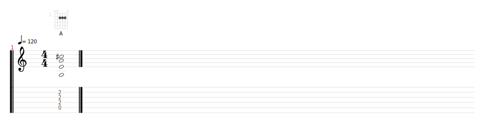
- **[Position 2]** En partant de la note tonique, ici la corde de **LA** à vide, on glisse sur la corde de **MI**
  jusqu'à trouver le **LA** à l'oreille.

  On plaque l'accord
  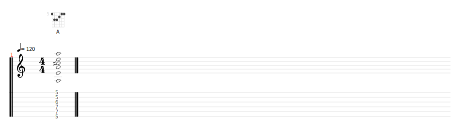

  En power chord cela donne
  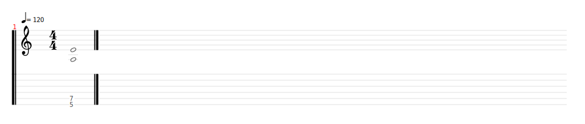
- **[Position 3]** On part toujours de la corde de **LA** et on glisse sur la même corde jusqu'à trouver le **LA** à
  l'oreille. Sur une corde à vide, c'est la **12ème case**

  On plaque l'accord
  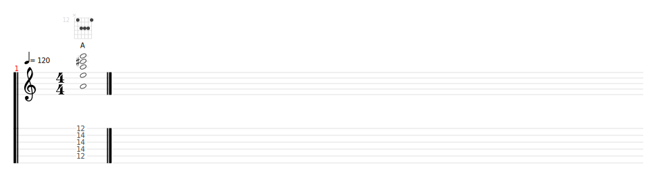

  En power chord cela donne
  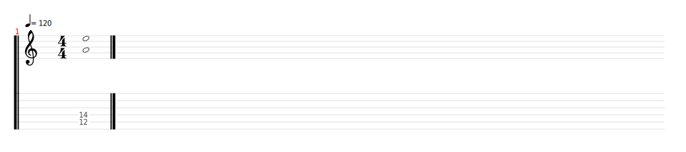

Le principe reste le même pour les autres accords :
- **[Position 1] MI**
  
  
  Power chord
  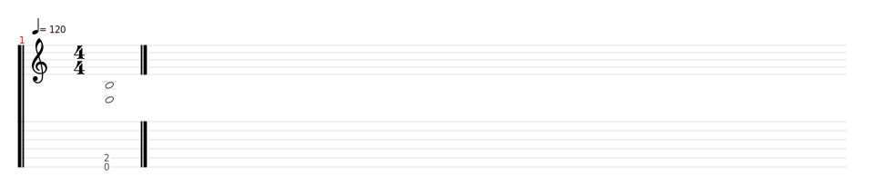
- **[Position 2] MI**
  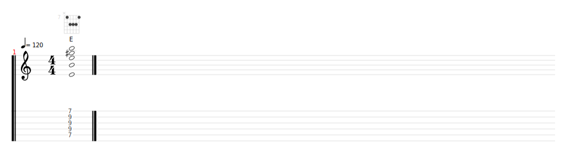
  
  Power chord
  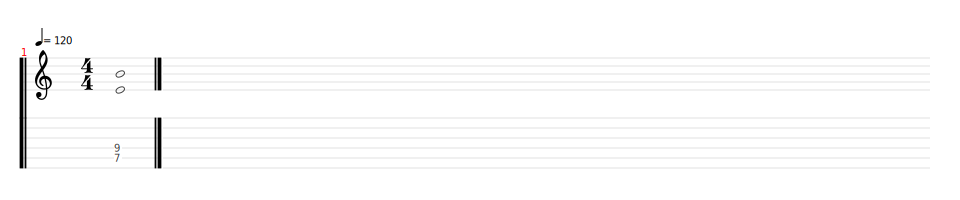
- **[Position 3] MI**
  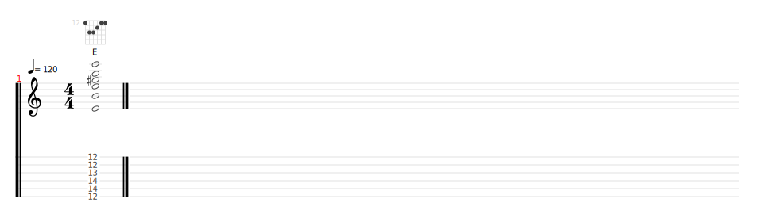
  
  Power chord
  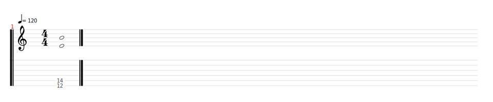

### Résumé
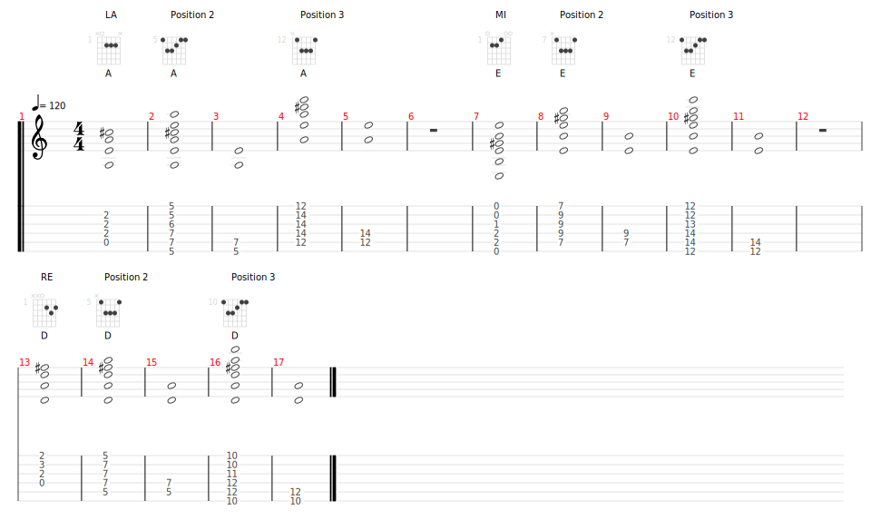

[Résumé Tux Guitar](./images/resume.tg)

## Quelques accords 
### Les accords de Knight of Cydonia
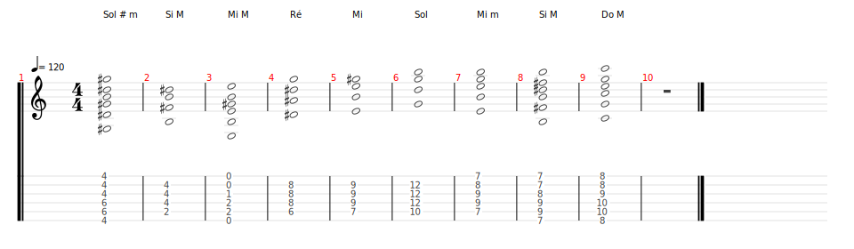
[Accords Tux Guitar](accords.tg)