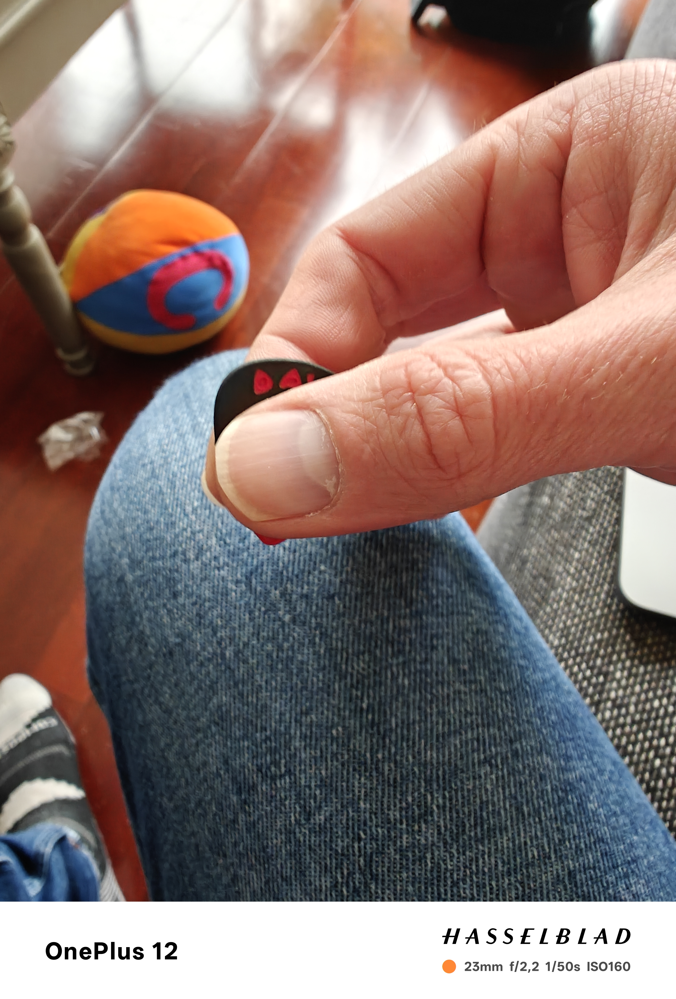
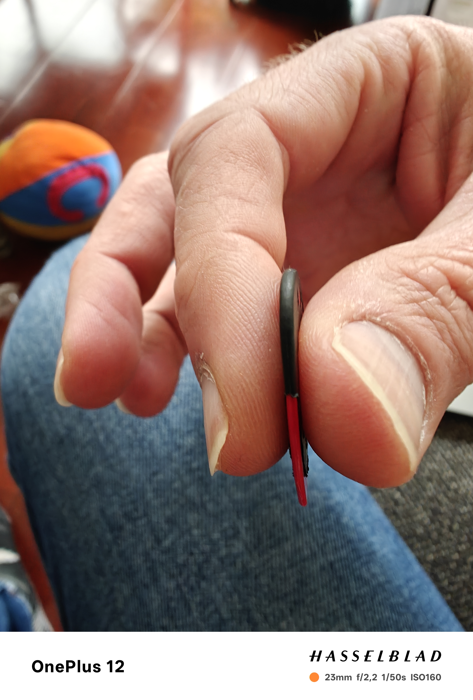

# Knights of Cydonia
- **Date de sortie :** 27 Novembre 2006 [Wikipedia](https://fr.wikipedia.org/wiki/Knights_of_Cydonia)
- [Vidéo](https://youtu.be/j8WP7aOD_9Q?si=WgMl7fxJNcWkimKN)
- [Videos cours](https://photos.google.com/album/AF1QipOqxhwR3w1Uuu9VAZmSkUyLZ9lDsacc7Iv9-DQ4)

## Technique
### Coda

- Pour les triolets comme pour la partie finale, il faut être souple en tenant le médiator de telle sorte qu'il rebondisse sur la corde. 
- La main doit être placée bien face aux cordes.
- Les doigts ne reposent pas sur le corps de la guitare
- Le médiator dépasse à peine

