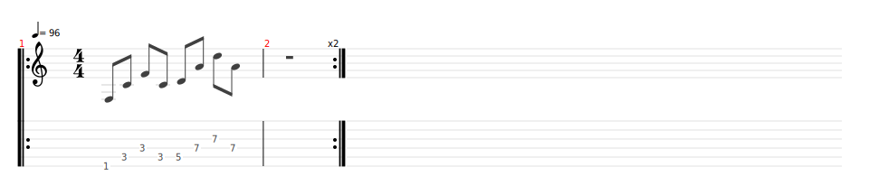
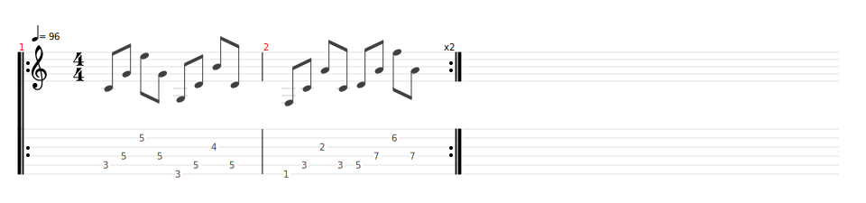

# Californication
- **Date de sortie :** Juin 1999 [Wikipedia](https://fr.wikipedia.org/wiki/Californication_(album))
- [Video](https://www.youtube.com/watch?v=6L0LIo35sF4)
- [Vidéos cours](https://www.youtube.com/playlist?list=PL-mUMncHrS0nEWrbCeeX2iVhRn5TD4SW6)

## Technique
### Pont
On peut jouer le pont de deux manières différentes

**En version "Power Chord" comme dans la vidéo sur le drive**

**En version originale**

### Rythmique
- Bien faire le balancier, sans arrêt entre les changements d'accords (voir la vidéo sur la rythmique).
- Poignet bien souple
- Médiator tenu avec les doigts dépliés

**&#x2193; &#x2191; :** Accords joués

**&#x2909; &#x2908; :** Accords non joués

Le pattern est toujours le même :

**&#x2193; &#x2909; &#x2908; &#x2191; &#x2193; &#x2909; &#x2193; &#x2909; &#x2908; &#x2191; &#x2193; &#x2909; &#x2193; &#x2909;**  